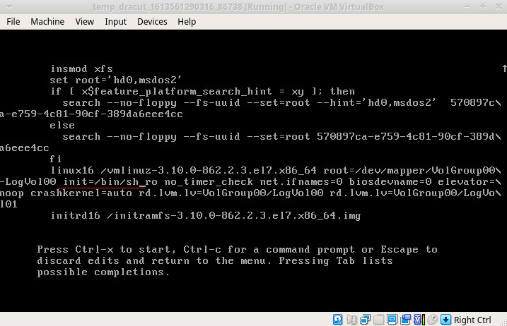
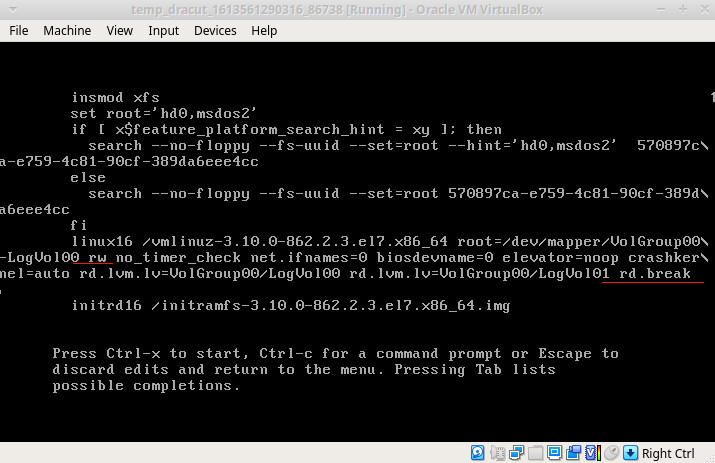
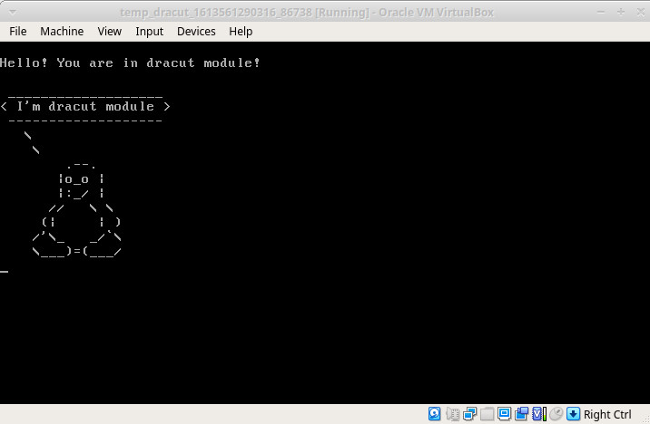

**[Стенд](Vagrantfile) для занятия  «Загрузка системы»**
___

Использован официальный [Vagrant box centos/7 v1804.02](https://app.vagrantup.com/centos/boxes/7/versions/1804.02)

* CentOS 7.5.1804.
* Добавлен дополнительный динамический диск формата VMDK размером 5Гб для переноса системы на отдельный том LVM  `$HOME/VirtualBox VMs`

___

> <h4> Домашнее задание 
>
>Работа с загрузчиком
>1. Попасть в систему без пароля несколькими способами
>2. Установить систему с LVM, после чего переименовать VG
>3. Добавить модуль в initrd
>
>4(*). Сконфигурировать систему без отдельного раздела с /boot, а только с LVM
>Репозиторий с пропатченым grub: https://yum.rumyantsev.com/centos/7/x86_64/
>PV необходимо инициализировать с параметром --bootloaderareasize 1m  </h5>
  
___
 <b> 1. </b> 
   * Попасть в систему без пароля можно загрузившись в однопользовательском режиме  

Для этого на этапе загрузки необходимо нажать клавишу `e` и попасть в меню загрузчика GRUB. Ищем строку начинающуюся с `linux16` где передаются параметры ядру, убираем параметры ассоциации консоли `console=tty0 console=ttyS0,115200n8`, так же убираем `rhgb quiet` что бы видеть загрузочные сообщения ядра и добавляем `init=/bin/sh`. После чего нажимаем `Ctrl+X` для начала загрузки системы.  



В данном случае файловая система монтируется в режиме read only и нам необходимо перемонтировать ее в read-write командой `mount -o remount,rw /`
Далее можно сменить пароль root стандартной коммандой `passwd root`
Так как в системе активирован SELINUX необходимо создать файл `touch /.autorelabel` для обновления меток, иначе залогиниться в систему после загрузки мы не сможем.  
  
  * Другим вариантом будет в строке параметров загрузчика указать `rd.break`.   

В таком случае система загружается в аварийном режиме и процесс запуска прерывается. Аналогично первому примеру нажимаем `e` что бы попасть в меню загрузчика GRUB. Находим строку начинающуюся с `linux16`, убираем параметры  `console=tty0 console=ttyS0,115200n8` и `rhgb quiet`, изменяем `ro` на `rw` и в конце добавляем `rd.break`.  `Ctrl+X` для начала загрузки системы.



Выполняем `chroot /sysroot` и меняем пароль `passwd root`. Перезагружаемся с параметром `enforcing=0` и обновляем метки SELinux командой `fixfiles -f relabel`. Параметр enforcing = 0 переводит систему в разрешающий режим SELinux. 

___
<b> 2. </b> Установить систему с LVM, после чего переименовать VG  

<em>Смотрим какие Volume Group есть в системе</em>
```
[root@dracut vagrant]# vgs
  VG         #PV #LV #SN Attr   VSize   VFree
  VolGroup00   1   2   0 wz--n- <38.97g    0 
```  
  
<em>Переименовываем VolGroup00 в Otus </em>
```
[root@dracut vagrant]# vgrename VolGroup00 Otus
  Volume group "VolGroup00" successfully renamed to "Otus"
```
<em>Далее правим /etc/fstab, /etc/default/grub, /boot/grub2/grub.cfg и
пересоздаем initrd image, чтобы он знал новое название Volume Group </em>

```
[root@dracut vagrant]# mkinitrd -f -v /boot/initramfs-$(uname -r).img $(uname -r)
*** Creating initramfs image file '/boot/initramfs-3.10.0-862.2.3.el7.x86_64.img' done ***
```
<em> Перезагружаемся и проверяем результат </em>
```
[root@dracut vagrant]# vgs
  VG   #PV #LV #SN Attr   VSize   VFree
  Otus   1   2   0 wz--n- <38.97g    0 
```
___
<b>3.</b>  Добавить модуль в initrd  

<em>Скрипты модулей хранятся в каталоге /usr/lib/dracut/modules.d/. Для того чтобы добавить свой модуль создаем директорию 01test, `mkdir /usr/lib/dracut/modules.d/01test`

Далее в этой директории создаем файлы [module-setup.sh](https://gist.githubusercontent.com/lalbrekht/e51b2580b47bb5a150bd1a002f16ae85/raw/80060b7b300e193c187bbcda4d8fdf0e1c066af9/gistfile1.txt) и [test.sh](https://gist.githubusercontent.com/lalbrekht/ac45d7a6c6856baea348e64fac43faf0/raw/69598efd5c603df310097b52019dc979e2cb342d/gistfile1.txt), делаем их исполняемыми.</em>

```
wget https://gist.githubusercontent.com/lalbrekht/e51b2580b47bb5a150bd1a002f16ae85/raw/80060b7b300e193c187bbcda4d8fdf0e1c066af9/gistfile1.txt -O /usr/lib/dracut/modules.d/01test/module-setup.sh

wget https://gist.githubusercontent.com/lalbrekht/ac45d7a6c6856baea348e64fac43faf0/raw/69598efd5c603df310097b52019dc979e2cb342d/gistfile1.txt -O /usr/lib/dracut/modules.d/01test/test.sh

chmod +x -R /usr/lib/dracut/modules.d/01test
```
<em>Пересобираем образ initrd командой `dracut -f -v` Перезагружаемся и видим пингвина при старте</em>


___
<b>4(*).</b> Сконфигурировать систему без отдельного раздела с /boot, а только с LVM
Репозиторий с пропатченым grub: https://yum.rumyantsev.com/centos/7/x86_64/
PV необходимо инициализировать с параметром --bootloaderareasize 1m   

Смотрим текущую конфигурацию дисков. Видим что используется отдельный раздел как /boot а диск sdb девственно чист. Создадим на диске sdb lvm том и перенес систему туда.
```
[vagrant@dracut ~]$ lsblk
NAME                    MAJ:MIN RM  SIZE RO TYPE MOUNTPOINT
sda                       8:0    0   40G  0 disk 
├─sda1                    8:1    0    1M  0 part 
├─sda2                    8:2    0    1G  0 part /boot
└─sda3                    8:3    0   39G  0 part 
  ├─VolGroup00-LogVol00 253:0    0 37.5G  0 lvm  /
  └─VolGroup00-LogVol01 253:1    0  1.5G  0 lvm  [SWAP]
sdb                       8:16   0    5G  0 disk 
```

Создадим таблицу разделов на диске sdb.

`parted /dev/sdb mklabel msdos; parted /dev/sdb mkpart primary ext4 0% 100%`
```
[root@dracut vagrant]# fdisk -l /dev/sdb                                  

Disk /dev/sdb: 5368 MB, 5368709120 bytes, 10485760 sectors
Units = sectors of 1 * 512 = 512 bytes
Sector size (logical/physical): 512 bytes / 512 bytes
I/O size (minimum/optimal): 512 bytes / 512 bytes
Disk label type: dos
Disk identifier: 0x0008102d

   Device Boot      Start         End      Blocks   Id  System
/dev/sdb1            2048    10485759     5241856   83  Linux
```
<em> Важный момент! Так как утилита parted при разметке диска в MBR и создании раздела стартует не с 63 блока а оставляет пространство между MBR и первым разделом более 32 кБ (1-й-62-й секторы), то использовать ключ --bootloaderareasize 1m не требуется так как резервировать область свыше стандартных 512 байт для LVM в начале диска не требуется. Но для успокоения создадим PV как указано в задании. </em>

```
[root@dracut vagrant]# pvcreate /dev/sdb1 --bootloaderareasize 1M
  Physical volume "/dev/sdb1" successfully created.

[root@dracut vagrant]# vgcreate Otus /dev/sdb1
  Volume group "Otus" successfully created

[root@dracut vagrant]# lvcreate -n root -l 100%FREE Otus
  Logical volume "root" created.

[root@dracut vagrant]# mkfs.ext4 /dev/mapper/Otus-root 
Writing superblocks and filesystem accounting information: done

[root@dracut vagrant]# lsblk
NAME                    MAJ:MIN RM  SIZE RO TYPE MOUNTPOINT
sda                       8:0    0   40G  0 disk 
├─sda1                    8:1    0    1M  0 part 
├─sda2                    8:2    0    1G  0 part /boot
└─sda3                    8:3    0   39G  0 part 
  ├─VolGroup00-LogVol00 253:0    0 37.5G  0 lvm  /
  └─VolGroup00-LogVol01 253:1    0  1.5G  0 lvm  
sdb                       8:16   0    5G  0 disk 
└─sdb1                    8:17   0    5G  0 part 
  └─Otus-root           253:2    0    5G  0 lvm
```
Отключим SELinux (nano /etc/selinux/config SELINUX=disable), swap (swapoff -a) и перенесем данные.

```
mkdir /mnt/root  
mount /dev/mapper/Otus-root /mnt/root  
rsync -avx / /mnt/root; rsync -avx /boot /mnt/root  
mount --rbind /dev/ /mnt/root/dev; mount --rbind /proc /mnt/root/proc; mount --rbind /sys /mnt/root/sys; mount --rbind /run /mnt/root/run  
chroot /mnt/root  
```
Установим загрузчик, правим fstab, пересобираем initrd и загружаемся с нового диска
```
yum-config-manager --add-repo=https://yum.rumyantsev.com/centos/7/x86_64/
yum install grub2 -y --nogpgcheck
nano /etc/fstab
nano /etc/default/grub
```
```
[root@dracut /]# cat /etc/fstab 
# /etc/fstab
# Created by anaconda on Sat May 12 18:50:26 2018
#
# Accessible filesystems, by reference, are maintained under '/dev/disk'
# See man pages fstab(5), findfs(8), mount(8) and/or blkid(8) for more info
#
/dev/mapper/Otus-root /                       ext4     defaults        0 0

[root@dracut /]# cat /etc/default/grub 
GRUB_TIMEOUT=1
GRUB_DISTRIBUTOR="$(sed 's, release .*$,,g' /etc/system-release)"
GRUB_DEFAULT=saved
GRUB_DISABLE_SUBMENU=true
GRUB_TERMINAL_OUTPUT="console"
GRUB_CMDLINE_LINUX="no_timer_check net.ifnames=0 biosdevname=0 elevator=noop crashkernel=auto rd.lvm.lv=Otus/root"
GRUB_DISABLE_RECOVERY="true"
```
```
grub2-mkconfig -o /boot/grub2/grub.cfg
dracut -f -v /boot/initramfs-3.10.0-862.2.3.el7.x86_64.img 
grub2-install /dev/sdb
```
После загрузки с нового диска видим следующую картину
```
[vagrant@dracut ~]$ lsblk
NAME                    MAJ:MIN RM  SIZE RO TYPE MOUNTPOINT
sda                       8:0    0   40G  0 disk 
├─sda1                    8:1    0    1M  0 part 
├─sda2                    8:2    0    1G  0 part 
└─sda3                    8:3    0   39G  0 part 
  ├─VolGroup00-LogVol00 253:1    0 37.5G  0 lvm  
  └─VolGroup00-LogVol01 253:2    0  1.5G  0 lvm  
sdb                       8:16   0    5G  0 disk 
└─sdb1                    8:17   0    5G  0 part 
  └─Otus-root           253:0    0    5G  0 lvm  /

[vagrant@dracut ~]$ df -h
Filesystem             Size  Used Avail Use% Mounted on
/dev/mapper/Otus-root  4.8G  797M  3.8G  18% /
devtmpfs               110M     0  110M   0% /dev
tmpfs                  118M     0  118M   0% /dev/shm
tmpfs                  118M  4.5M  114M   4% /run
tmpfs                  118M     0  118M   0% /sys/fs/cgroup
tmpfs                   24M     0   24M   0% /run/user/1000
```
Старый диск можем "прибить" и будет вот так 
```
[root@dracut vagrant]# wipefs -a -f /dev/sda
/dev/sda: 2 bytes were erased at offset 0x000001fe (dos): 55 aa
/dev/sda: calling ioclt to re-read partition table: Device or resource busy

[vagrant@dracut ~]$ lsblk
NAME          MAJ:MIN RM SIZE RO TYPE MOUNTPOINT
sda             8:0    0  40G  0 disk 
sdb             8:16   0   5G  0 disk 
└─sdb1          8:17   0   5G  0 part 
  └─Otus-root 253:0    0   5G  0 lvm  /
```