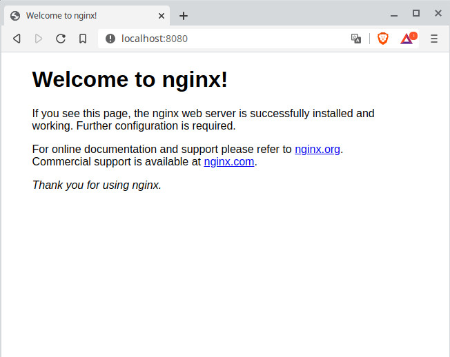

**[Стенд](Vagrantfile) для занятия  « Автоматизация администрирования. Ansible-1.»**
___

Использован официальный [Vagrant box centos/7 v2004.01](https://app.vagrantup.com/centos/boxes/7/versions/2004.01)

* CentOS Linux 7 (1CPU/256RAM) 
* local_ip: 10.0.10.10

___

Домашнее задание

<h5> 
Подготовить стенд на Vagrant как минимум с одним сервером. На этом сервере используя Ansible необходимо развернуть nginx со следующими условиями:

    необходимо использовать модуль yum/apt
    конфигурационные файлы должны быть взяты из шаблона jinja2 с перемененными
    после установки nginx должен быть в режиме enabled в systemd
    должен быть использован notify для старта nginx после установки
    сайт должен слушать на нестандартном порту - 8080, для этого использовать переменные в Ansible

Домашнее задание считается принятым, если:

    предоставлен Vagrantfile и готовый playbook/роль ( инструкция по запуску стенда, если посчитаете необходимым )
    после запуска стенда nginx доступен на порту 8080
    при написании playbook/роли соблюдены перечисленные в задании условия
 

 </h5>
  
___
___

Представленный Vagrantfile использует провизор Ansible, запуск плейбука отдельно не требуеся. В процессе будет добавлен официальный репозиторий NGINX для Centos/RHEL, установлен NGINX и запущен с конфигурацией из шаблона. Порт 8080 прокинут на аналогичный для хост машины. (127.0.0.1:8080)

`
